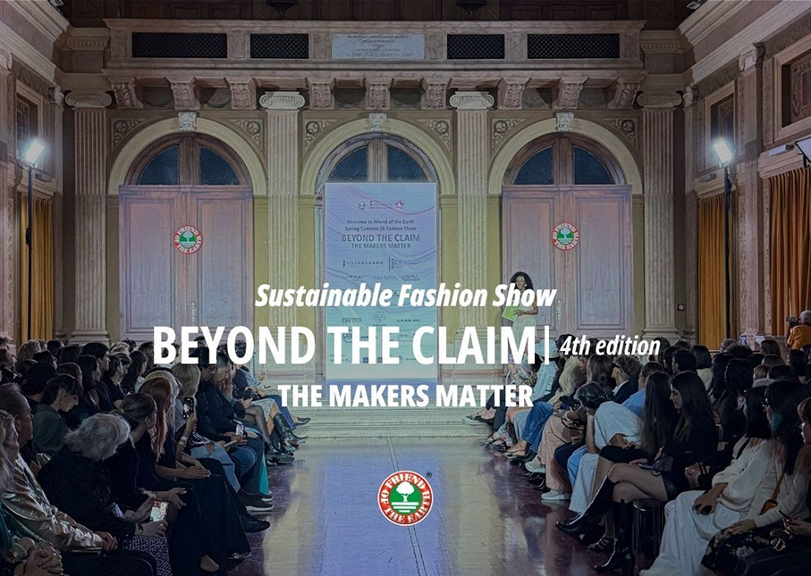

# Beyond the Claim 2025 - Sfilata Sostenibile

> **Friend of the Earth** è tornata protagonista durante i giorni della **Settimana della Moda di Milano** con la quarta edizione di **“Beyond the Claim” – The Makers Matter**
 

Un evento promosso dalla Friend of the Earth, progetto della **World Sustainability Organization (WSO)**, per la certificazione di prodotti e servizi che rispettano l’ambiente e le specie in pericolo: **“Beyond the Claim” – The Makers Matter** è la sfilata collettiva con la partecipazione di **13 brand selezionati** che hanno presentato le loro nuove proposte per la collezione Spring Summer 2026. L’evento si è tenuto presso l’Istituto dei Ciechi di Milano, un luogo simbolico che ha ospitato questa importante occasione dedicata alla moda sostenibile. 

Dopo aver già sostenuto con successo le edizioni precedenti, **ApexBrasil** ha rinnovato la collaborazione con Friend of the Earth per rafforzare la presenza di eccellenti brand brasiliani nel panorama globale della moda sostenibile. Quest’anno ApexBrasil ha sponsorizzato i marchi **Alina Amaral, Ana de Jour, Celeste, Ludimila Heringer, Natural Cotton Color e Villa Dharma**, che hanno presentato le loro collezioni insieme ad altri brand selezionati da Friend of the Earth. Le sei aziende hanno partecipato attraverso Texbrasil (Programma di Internazionalizzazione dell’Industria Tessile e della Moda Brasiliana), frutto della partnership tra Abit (Associazione Brasiliana dell’Industria Tessile e dell’Abbigliamento) e ApexBrasil.

**BRANDS PARTECIPANTI**

**Alina Amaral**: trasforma tecniche artigianali tradizionali in capi contemporanei, raccontando storie profonde e radici culturali del Nordest brasiliano con un approccio sostenibile e autentico. 

**Ana de Jour**: brand che celebra l’eleganza senza tempo e la femminilità autentica, Ana de Jour produce capi realizzati con materie prime certificate e attenzione artigianale, privilegiando la sostenibilità in ogni fase produttiva. 

**Celeste**: specializzato in beachwear sostenibile, Celeste utilizza materiali certificati e biodegradabili, promuovendo un consumo consapevole e collaborando con artigiani locali per valorizzare tradizione e innovazione. 

**Esmée-e**: brand britannico specializzato in resortwear, Esmée utilizza cotone egiziano organico e tinture naturali, creando capi leggeri e confortevoli che uniscono eleganza e responsabilità ambientale. 

**House of Narma**: nato a Londra, House of Narma intreccia storytelling e artigianato etico, utilizzando tessuti certificati e materiali deadstock per creare capi slow fashion che celebrano la diversità culturale e la sostenibilità. 

**ILKAN.KO**: fondato a Madrid, ILKAN.KO unisce artigianato tradizionale e design contemporaneo con materiali certificati, raccontando storie culturali attraverso capi unisex di alta qualità e sostenibilità. 

**LBF**: brand brasiliano di gioielli placcati in oro, LBF unisce design contemporaneo e artigianato tradizionale, promuovendo l’empowerment femminile e l’uso di materiali riciclati con un modello di business sostenibile. 

**Las Gringas**: beachwear ispirato alla foresta amazzonica, realizzato con tessuti certificati e processi a basso impatto, con un impegno concreto nella tutela ambientale attraverso donazioni a progetti di conservazione. 

**Ludimila**:marchio di slow fashion che impiega tinture naturali e tessuti amazzonici biodegradabili, Ludimila unisce artigianato e design per creare capi unici, rispettosi dell’ambiente e della cultura locale. 

**Natural Cotton Color**: con la collezione “Tropeiros da Borborema”, NCC omaggia la tradizione del cotone biologico tinto naturalmente, unendo patrimonio culturale e design contemporaneo. La collezione valorizza tecniche artigianali locali e utilizza cotone coltivato senza irrigazione, riducendo drasticamente l’uso di acqua. 

**Shirvanna**: marchio cipriota che valorizza il riuso creativo di scarti tessili e materiali vintage, Shirvanna crea capi genderless ispirati alla tradizione pastorale, con un forte impegno verso la slow fashion. 

**Villa Dharma**: nato nel nord-est del Brasile, Villa Dharma crea capi in lino dipinti a mano con tinture naturali, valorizzando mestieri ancestrali e pratiche rigenerative, per una moda che unisce cura del corpo e rispetto per la Terra. 

**Zoe Klose**: brand svizzero che trasforma rifiuti tessili in capi sportivi e casual, Zoe Klose promuove l’economia circolare e la pulizia degli oceani con collezioni unisex innovative e sostenibili.

**Beyond the Claim 2025** rappresenta un momento di grande rilievo per la **moda sostenibile**, unendo creatività, innovazione e responsabilità ambientale sotto il segno di Friend of the Earth. L’evento ha confermato l’impegno globale verso un’industria della **moda più trasparente, etica e rispettosa del pianeta**.
