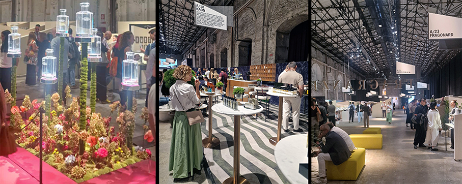
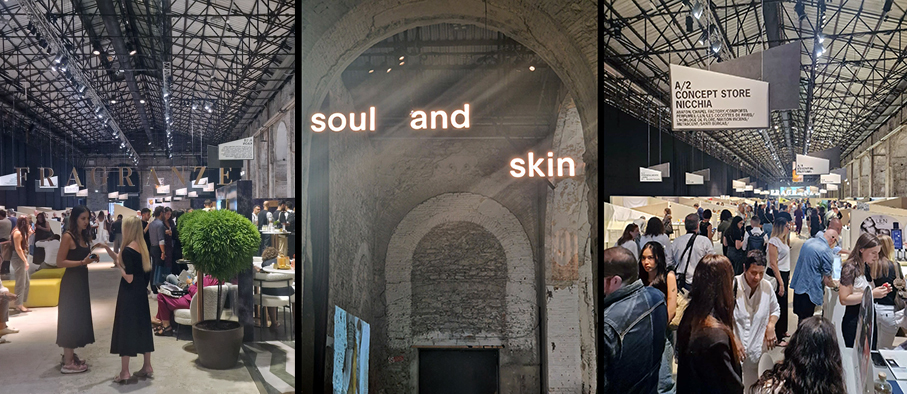

# Pitti Fragranze 2025

## Dal 12 al 14 settembre 2025 la Stazione Leopolda di Firenze ha ospitato la 23ª edizione di Pitti Fragranze

Per l’edizione 2025 di Pitti Fragranze, il tema-guida “Composition” ha sviluppato molti percorsi olfattivi da parte dei brand, grazie all’idea di accostamento, contrappunto e costruzione delle fragranze. 

Con i suoi 258 marchi, Fragranze è l’appuntamento di riferimento per scoprire le novità della profumeria di ricerca e del mondo beauty, e l’occasione in cui si lanciano le tendenze della cultura olfattiva sulla scena internazionale.

Quasi 2.200 compratori arrivati a Firenze per il salone, in forte crescita (+32%) rispetto a un anno fa, con presenze di operatori di altissima qualità e sempre più internazionali.

Spagna, Germania, Francia e Svizzera in testa alle presenze estere, forte aumento anche per i compratori italiani. \

I trend del momento sono apparsi chiari: giocare con note gourmand e insolite come pop corn, banana e ciliegia, accesi da note di vaniglia. L’intento è quello di stupire, creando mix di note olfatti decisamente originali e non appartenenti alla profumeria classica. Molte maison hanno costruito i loro lanci attorno all’idea di contrasti (chiaro/scuro, dolce/amaro, naturale/artificiale). 

Allo stesso tempo è emersa con forza una nuova area dedicata alla cura della pelle, Soul & Skin, che porta al centro dell’attenzione prodotti skincare con un approccio sia scientifico sia rituale. 

Si consolida infatti l’idea che skincare e profumeria si contaminino, con prodotti che propongono efficacia tecnica e narrazione sensoriale. Molti nuovi lanci skincare lo confermano.

## **Soul & Skin** Sezione Skincare

**Annab Cosmetics** presenta Balance, la prima crema SPF+30 “senza filtri” (NOfilter UV complex®) che difende da UVA/UVB e dalla luce blu, combina microalga antismog, semi di lampone e alghe marine upcycled, con funzioni idratanti, illuminanti e rigeneranti. Ex giornalista di cronaca nera, cerca di dedicarsi alla bellezza e al tempo per se stessi, per raggiungere un benessere fatto di ingredienti naturali.
